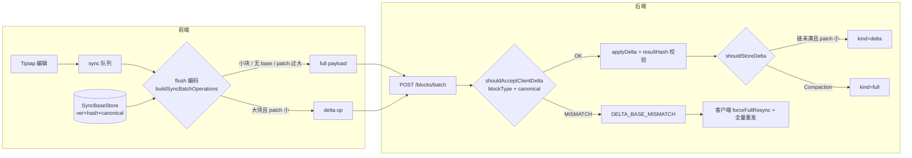

# 2026-06-12 Delta Overlay + Compaction 混合同步复盘

> 覆盖块级增量传输（Delta Overlay）、存储链（Compaction）、以及 `DELTA_BASE_MISMATCH` 导致的「假双请求」排查与修复  
> 涉及仓库：`yuediter`（前端 `editor-demo/app`）、`yumer-server`（后端）

---

## 1. 背景与目标

### 1.1 问题

当前 `update` 操作前后端均为**整块全量 payload**。超大代码块（~348KB）每次按键都传输/落库完整 JSON，带来：

- 请求体接近或触及 2MB 限制；
- `block_versions` 表快速膨胀；
- 弱网下 autosync 延迟明显。

### 1.2 目标

**混合策略**——小块零改动，大块走 delta：

| 条件 | 传输 | 存储 |
|------|------|------|
| canonical JSON < 8KB | 全量 payload（现有路径） | 全量 `block_versions` 行 |
| canonical JSON ≥ 8KB 且 patch ≤ 50% | delta（`baseVer + baseHash + patch + resultHash`） | 全量基准 + delta 链，链长 ≥ 12 时内联 Compaction |
| delta 校验失败 | 单块回退全量重发 | 全量行 |

传输编码与存储编码**解耦**：服务端无论收到 delta 还是全量，都在内存重建完整 payload 后再决定落库形态；SSE / plainText / hash 校验路径不变。

---

## 2. 用户可见症状

### 2.1 初版验收现象

1. **大代码块改一行仍发全量**——Network 中 `operations[].data.payload` 体积 ~348KB；
2. **一次编辑触发两次 `/blocks/batch`**——间隔 ~30ms，两个不同 `clientBatchId`。

### 2.2 日志特征（`sync-erro.log`，doc `doc_1781255235930_073bf7c5`）

| 批次 | clientBatchId | 请求形态 | 结果 |
|------|---------------|----------|------|
| 第 1 次 | `batch_1781262919793_7b5sdq` | delta（`payloadType: null`） | `DELTA_BASE_MISMATCH` |
| 第 2 次 | `batch_1781262920061_tp0ue4` | 全量（`payloadType: "codeBlock"`） | 成功，`draftRevision` 22→23 |

代码块 `textPreview` 含 `\r\n` 混排换行。

---

## 3. 根因分析

### 3.1 「双请求」不是 phantom rescan

最初怀疑 ACK 后 `batch-ack-rescan` 重复 derive。日志时间线表明：

```text
flush:dispatch (delta) → flush:response (MISMATCH) → forceFullResync
→ 同一 flush while 循环立即 flush:dispatch (full) → flush:response (success)
```

双请求来自 **`useDocumentSync` flush 循环内的设计回退**，不是 rescan 误触发第二次编辑。

相关代码：`src/hooks/useDocumentSync.ts` — `isDeltaBaseMismatchResult` → `baseStore.forceFullResync(blockId)` → 循环继续发全量。

### 3.2 `DELTA_BASE_MISMATCH` 主因：canonical baseHash 不一致

服务端 `shouldAcceptClientDelta` 逻辑：

```text
baseHash = SHA256(canonicalStringify(basePayload))
if baseHash !== delta.baseHash → DELTA_BASE_MISMATCH
```

前后端 hash 不等，常见差异源：

| # | 差异点 | 客户端 | 服务端（修复前） |
|---|--------|--------|------------------|
| 1 | 顶层 `type` | seed 时 `toSyncPayload` 合并 `block.type`，codeBlock attrs 走规范化 | DB payload 常无顶层 `type`，跳过 codeBlock attrs 规范化 |
| 2 | 换行符 | 编辑器/粘贴内容含 `\r\n` | 原样存储，未统一为 `\n` |
| 3 | language 别名 | `js` → `javascript`（`normalizeCodeLanguage`） | 仅 `trim()`，不做别名映射 |
| 4 | delta 链重建 | — | `resolveFromChain` 用 `JSON.stringify` 而非 `canonicalStringify` |

### 3.3 次要问题（同轮已修）

- **ACK 后 base 未更新**：delta 失败无 `version`，`recordAck` 跳过；修复 MISMATCH 后 delta 一次成功即可写入 base。
- **ACK rescan 重复 derive**：canonical 相等时跳过 derive；`ack-content-patch` 移除冗余 snapshot capture。
- **旧后端 DTO**：未部署时报 `delta should not exist, payload must be an object`——需重启 + 跑迁移。

---

## 4. 方案架构



### 4.1 共享 Delta 规范

- **Canonical 对象**：key 字典序、剥离 sync attrs（`blockId` / `clientId` / `sortKey` 等）、codeBlock attrs 规范化、字符串 `\r\n`/`\r` → `\n`；
- **Diff**：`diff-match-patch`，格式 `dmp-v1`；
- **完整性**：`baseHash` / `resultHash` = SHA256(canonical JSON)；
- **模块**：前端 `src/services/sync/delta.ts`，后端 `src/modules/blocks/block-delta/`，共享 fixture 互测。

---

## 5. 交付清单

### 5.1 前端（`editor-demo/app`）

| 模块 | 路径 | 职责 |
|------|------|------|
| Delta 规范 | `src/services/sync/delta.ts` | canonical、DMP、hash、换行规范化、`ensurePayloadType` |
| 编码入口 | `src/services/sync/delta-encoding.ts` | re-export + `stripPayloadForSync` |
| Base store | `src/services/sync/base-store.ts` | 加载/ACK 维护每块 `ver+hash+canonical`；`forceFullResync` |
| Flush 编码 | `src/services/sync/api.ts` | `buildSyncBatchOperations` delta 决策 |
| 加载 seed | `src/services/document.ts` | `seedSyncBaseStoreFromBlocks` |
| Flush 回退 | `src/hooks/useDocumentSync.ts` | MISMATCH → `forceFullResync`；ACK `recordAck` |
| ACK 防重复 | `src/services/sync/snapshot.ts` | canonical 相等跳过 derive |
| Fingerprint | `src/services/sync/engine.ts` | 复用 `delta.ts` 的 `canonicalStringify` |

**单测**：`delta.test.ts`、`base-store.test.ts`、`api.test.ts`、`ack-rescan-filter.test.ts`、`snapshot-ack-skip.test.ts`、`batch-failure-delta.test.ts`

### 5.2 后端（`yumer-server`）

| 模块 | 路径 | 职责 |
|------|------|------|
| 迁移 | `src/database/migrations/1783200000000-AddBlockVersionDeltaFields.ts` | `payloadKind` / `baseVer` / `delta` |
| Delta 核心 | `src/modules/blocks/block-delta/block-delta.ts` | canonical、校验、存储决策 |
| Code attrs | `block-delta/sync-code-block-attrs.ts` | language 别名对齐前端 |
| Payload 解析 | `block-delta/block-payload-resolver.service.ts` | 链重建 + LRU |
| 写路径 | `src/modules/blocks/blocks.service.ts` | batch/update 支持 delta；Compaction |
| DTO | `dto/update-block.dto.ts`、`dto/block-delta.dto.ts` | payload 与 delta 互斥 |
| GC | `gc-delta-chain.util.ts` | 链引用感知 |
| 加载 | `documents.service.ts` | edit-content 返回 `ver` / `hash` |

**单测 + e2e**：`block-delta.spec.ts`、DTO spec、`document-sync.e2e-spec.ts`（delta overlay 场景）

### 5.3 MISMATCH 修复（canonical 对齐，2026-06-12 追加）

- `ensurePayloadType(payload, block.type)` — hash 前合并顶层 type；
- 字符串换行统一 `\n`（前后端 `normalizePayload`）；
- `shouldAcceptClientDelta({ basePayload, delta, blockType })`；
- 后端 `normalizeSyncCodeLanguage` 与前端 `COMMON_LANG_ALIASES` 一致；
- `resolveFromChain` 改用 `applyDelta` + canonical 规则。

---

## 6. 验证清单

### 6.1 部署前

```bash
# 前端
cd editor-demo/app && pnpm exec vitest run src/services/sync/__tests__/

# 后端
cd yumer-server && pnpm typeorm:migration:run
cd yumer-server && pnpm test -- src/modules/blocks/block-delta/
cd yumer-server && NODE_ENV=development pnpm test:e2e -- test/document-sync.e2e-spec.ts -t "delta overlay"
```

### 6.2 手动验收

1. 重启后端 `pnpm start:dev`；
2. **硬刷新**页面（重新 seed base store）；
3. 打开含 ~348KB 代码块的文档，改一行；
4. Network：**仅 1 个** `/blocks/batch`，含 `data.delta`，无 `DELTA_BASE_MISMATCH`；
5. Sync Debug：同一 flush 内不应出现两个 `clientBatchId`；
6. 刷新后内容一致；再次小编辑仍走 delta。

### 6.3 回归

- 小块（< 8KB）仍发全量，行为与改前一致；
- delta 链达到 Compaction 阈值后读取正确；
- SSE 下游仍收到全量 payload。

---

## 7. 经验教训

1. **传输优化依赖 bit-exact canonical**——任何「仅 hash 用一套、diff 用另一套」的隐式差异都会在第一块大文档上爆炸；DB 存什么、seed 用什么、校验用什么必须同一函数族。
2. **DB payload 缺 `type` 是历史债**——块类型在 `blocks.type` 列，JSON 里不一定有；delta 校验必须显式 `merge(block.type)`，不能假设 payload 自描述。
3. **Windows 换行 `\r\n` 是真实数据**——代码块粘贴脚本最常见；canonical 层必须 normalize，不能留给编辑器碰运气。
4. **回退路径要可观测**——`DELTA_BASE_MISMATCH → forceFullResync → 全量` 是正确降级，但日志里看起来像「双写 bug」；Sync Debug 应标注 `diagnosticCode` 与 flush 代数。
5. **前后端分仓库部署**——DTO/迁移未上线时前端 delta 会直接 400；验收前确认后端版本与迁移状态。
6. **双请求排查先看 diagnosticCode**——再查 rescan / derive，避免在 ACK 链路上过度修复。

---

## 8. 遗留与后续（可选）

| 项 | 说明 | 优先级 |
|----|------|--------|
| edit-content 返回 `canonicalHash` | 加载时 local hash ≠ server 则 preemptive `forceFullResync`，避免先失败再全量 | P2 |
| 服务端 `calculateHash` 与 canonical hash 统一 | 写路径仍用 `JSON.stringify(content)`，与 delta canonical 是两套 | P3 |
| 大表格 / 其他块类型压测 | 当前主场景为 codeBlock | P2 |
| Sync Debug 展示 delta 体积比 | 便于验收 patch ratio | P3 |

---

## 9. 提交指南

### 9.1 前端仓库 `editor-demo/app`

**纳入提交：**

- `src/services/sync/`（delta、base-store、api、snapshot、engine、tests、fixtures）
- `src/hooks/useDocumentSync.ts` 及关联 test
- `src/services/document.ts`
- `src/services/sync/batch-failure.ts`、`types.ts`
- `package.json`、`pnpm-lock.yaml`（`diff-match-patch`）
- `docs/2026-06-12-delta-overlay-sync-retrospective.md`

**不要提交：**

- `sync-erro.log`、`nul`
- `delta_overlay_混合同步_653e745d.plan.md`（本地 plan 草稿，可选归档后另提）

**建议 commit message：**

```text
feat(sync): add delta overlay encoding for large block updates

Introduce canonical delta transport for blocks ≥8KB with base-store
seeding, DELTA_BASE_MISMATCH fallback, and ACK rescan dedup. Align
canonical rules (type merge, CRLF, codeBlock attrs) with the server.
```

### 9.2 后端仓库 `yumer-server`

**纳入提交：**

- `src/modules/blocks/block-delta/`
- `src/modules/blocks/blocks.service.ts`、`blocks.module.ts`
- `src/database/migrations/1783200000000-AddBlockVersionDeltaFields.ts`
- `src/entities/block-version.entity.ts`
- DTO / GC / documents 相关改动与 tests
- `test/document-sync.e2e-spec.ts`

**不要提交：**

- `.codegraph/`

**建议 commit message：**

```text
feat(blocks): support delta overlay storage and compaction

Add block_versions delta chain, payload resolver, and batch delta
validation with canonical hash alignment (block type, CRLF, language
aliases). Include migration, GC chain awareness, and e2e coverage.
```

### 9.3 提交顺序

1. **先后端**（迁移 + API）→ 跑迁移 → 重启 `start:dev`；
2. **再前端** → 硬刷新验收；
3. 两仓库分别 push（前端当前 ahead 2 commits，注意与 delta 改动的关系）。

---

## 10. 关联文档

- 方案 plan（本地）：`delta_overlay_混合同步_653e745d.plan.md`
- 同步稳定性基线：`docs/2026-06-11-sync-stability-hardening-retrospective.md`
- 后端链路分析：`yumer-server/docs/session/sync-stability-analysis.md`
