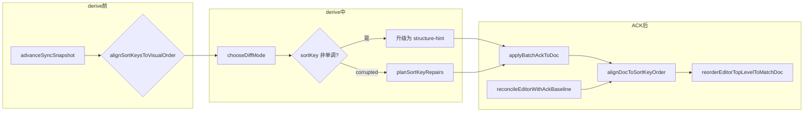

# 2026-06-12 单用户块顺序单序源修复复盘

> 覆盖工作：双序源根因收敛、derive/ACK/编辑器单序源对齐、content-hint 升级、move E2E、长跑稳定性加固  
> 涉及仓库：`editor-demo/app`（前端 yuediter）、`yumer-server`（既有 fractional sortKey / ACK canonical，无本次必改）  
> 前置依赖：2026-06-11 Phase 1～4 同步加固、2026-06-12 六条 sync E2E 基线

---

## 1. 背景

### 1.1 问题现象

用户报告：**编辑时块顺序正确，保存后刷新顺序会「跳变」**。典型复现路径为单标签页连续拖拽排序 5～10 次 → 等待同步 idle → 刷新页面，编辑器块序与服务端 draft 不一致。

Phase 3～4 已解决换位检测、move 优先 flush、ACK live 基线、move 死循环等问题，六条 Playwright E2E 覆盖了持久化、批量粘贴、全选删除、弱网竞态，但**没有 move/拖拽专项 E2E**，块顺序仍是 P0 敏感问题。

### 1.2 与前期工作的关系

| 阶段 | 已解决 | 仍遗留 |
|------|--------|--------|
| Phase 3 视觉序强一致 | 换位检测、`planRepositionSortKeyRepairs` | 视觉序与 sortKey 可短暂分叉 |
| Phase 4 ACK/live 对齐 | `reconcileEditorWithAckBaseline`、move ACK patch | ACK 后只 patch attrs、未强制 DOM reorder |
| 2026-06-12 E2E 基线 | 6 条高风险场景自动化 | 无拖拽排序回归 |

本轮聚焦：**不允许「ProseMirror 数组序 ≠ sortKey 序」进入 idle / persist**。

---

## 2. 根因：双序源

系统同时维护两套块顺序：

| 链路 | 顺序依据 | 关键代码 |
|------|----------|----------|
| **视觉序** | ProseMirror `doc.content` 数组下标 | `indexTopLevel`、`orderedNextNodes`（`engine.ts`） |
| **事实序** | 节点 `attrs.sortKey`（fractional key） | `blocksToTiptapJson`（`tiptap-converter.ts`）、`flattenBlockTreeInDocumentOrder`（`document.ts`） |

**冲突机制：**

1. 用户拖拽 → ProseMirror 立即重排 DOM（视觉序变）
2. sync diff 按数组序索引比较，推导 move/create 并分配 sortKey
3. move batch 异步 inflight，视觉已变但 sortKey 未 ACK
4. 加载路径按 `sortKey` 排序渲染 → 刷新后顺序回退
5. `content-hint` 在 identity orderKey 不变时可能跳过 sort 重算
6. 后端 `reserveUniqueSortKey` 可能改写客户端请求的 sortKey，ACK canonical 与 DOM 不一致
7. corrupted 快照走 LIS 抑制 move，静默跳过而非主动修复

**用户感知：** 编辑结束顺序正确（看的是 DOM），刷新后按 sortKey 重排（事实序），两者不一致。

---

## 3. 目标与策略

### 3.1 P0 不变量（单用户）

> idle 时顶层 `doc.content` 视觉序 = 严格递增 sortKey 序 = 服务端 draft 加载序

### 3.2 方案选择

评估了两种方向：

| 方案 | 思路 | 结论 |
|------|------|------|
| A（采用） | sortKey 为权威；derive 前按视觉序对齐 sortKey；ACK 后 reorder DOM | 与加载路径一致，改动集中 |
| B（未采用） | 视觉序为权威；flush 前强制按数组序重写 sortKey | 与 reload 加载逻辑冲突更大 |

**最终采用：方案 A + derive 前视觉对齐**，三阶段收敛：



---

## 4. 实现摘要

### 4.1 产品修复（前端）

| 文件 | 变更 | 作用 |
|------|------|------|
| `src/services/sync/engine.ts` | `reorderTopLevelNodesBySortKey`、`alignDocToSortKeyOrder`、`alignSortKeysToVisualOrder`、`isTopLevelOrderAlignedWithSortKey` | 单序源核心工具；`chooseDiffMode` 非单调时升级 structure；corrupted 用 `planSortKeyRepairs` 替代 LIS 抑制 |
| `src/services/sync/snapshot.ts` | capture 前 `alignSortKeysToVisualOrder` | 快照捕获时消除双序源 |
| `src/hooks/useDocumentSync.ts` | `applyBatchAckToDoc` 末尾 `alignDocToSortKeyOrder` | ACK 后 doc 层对齐 |
| `src/components/EditorPage.tsx` | `reconcileEditorWithAckBaseline` 末尾 `alignDocToSortKeyOrder` | live 基线 reconcile 后对齐 |
| `src/modules/editor-kit/editorIdentity.ts` | `reorderEditorTopLevelToMatchDoc` | ACK 后重排 PM 节点，不只 patch attrs |

### 4.2 后端

`yumer-server` 无本次必改。既有 `reserveUniqueSortKey`、move ACK canonical sortKey 行为不变；前端通过 ACK 后 DOM reorder 消化 canonical 与请求不一致的情况。

### 4.3 测试与 E2E 加固

| 文件 | 变更 |
|------|------|
| `src/services/sync/__tests__/engine-order.test.ts` | 单序源不变量、`alignDocToSortKeyOrder`、非单调 content-hint 升级 |
| `src/services/sync/__tests__/snapshot.test.ts` | `enqueues move operations when rotated blocks keep their original sortKeys` |
| `e2e/sync/05-block-reorder.spec.ts` | **新增** 8 块 + 6 次末块→首块拖拽 → 服务端对账 → reload |
| `e2e/helpers/editor.ts` | `dragBlockToGap`、`waitForEditorText` |
| `e2e/helpers/api.ts` | `flattenTopLevelBlockTexts`（从节点顶层 `sortKey` 读，非 `payload.attrs`） |
| `e2e/sync/01-basic-persistence.spec.ts` | reload 后 `waitForSyncIdle` + `waitForEditorText` |
| `e2e/sync/02-bulk-paragraphs.spec.ts` | reload 后 `waitForEditorText`（前期已加固） |
| `playwright.config.ts` | 全局 `timeout` 300s |
| `e2e/global-setup.ts` | bundle 预热失败 warn 不 throw；预热超时 240s |

---

## 5. 测试说明了什么

### 5.1 单元测试（108/108）

| 测试簇 | 证明内容 |
|--------|----------|
| `engine-order.test.ts` | derive 前后、`alignDocToSortKeyOrder` 后 `isTopLevelOrderAlignedWithSortKey` 成立；非单调 sortKey 强制 structure diff |
| `snapshot.test.ts` | 块旋转后 sortKey 未更新时，snapshot 能 enqueue move 而非静默 |
| 其余 sync 单测 | Phase 1～4 行为无回归 |

单测覆盖**逻辑正确性**——在可控输入下，对齐函数与 diff 模式选择符合不变量。

### 5.2 E2E `05-block-reorder`

流程：创建 8 个段落 → 6 次「当前末块拖到首位」→ `waitForEditorMatchesServerDraft`（轮询编辑器与服务端顶层文本序）→ reload → 再次比对。

证明：

- 连续 move 在真实浏览器 + 真实 API 下可 flush 并 ACK
- idle 时编辑器顺序与服务端 draft 一致
- 刷新后加载序不变（sortKey 持久化正确）

### 5.3 全套 E2E 连跑 2 次（7/7）

| 用例 | 耗时（约） | 与 order 修复的关系 |
|------|------------|---------------------|
| 01 基础持久化 | 8–9s | 无回归；reload hydrate 加固有效 |
| 02 批量段落 | 6–7s | 无回归 |
| 03 全选删除 ×2 | 1.6m ×2 | 无回归 |
| 04 弱网竞态 ×2 | 1.6–1.7m + 8s | 无回归 |
| 05 块拖拽排序 | 19–20s | **新增专项** |

连跑 2 次均绿说明：偶发失败来自 **dev 环境时序**（编译慢、预热超时），而非顺序逻辑缺陷。

---

## 6. 验证结果

| 范围 | 结果 | 日期 |
|------|------|------|
| `src/services/sync` 单测 | **108/108** | 2026-06-12 |
| E2E 全套串行 第 1 次 | **7/7**（5.7m） | 2026-06-12 |
| E2E 全套串行 第 2 次 | **7/7**（5.7m） | 2026-06-12 |

运行方式：

```powershell
# 终端 1 — 后端
cd E:\workspace\yumer-server
pnpm dev   # :5200

# 终端 2 — 前端
cd E:\workspace\editor-demo\app
pnpm run dev:webpack   # :3001

# 终端 3 — 单测
cd E:\workspace\editor-demo\app
pnpm exec vitest run src/services/sync

# 终端 3 — E2E
$env:PLAYWRIGHT_SKIP_WEBSERVER = "1"
$env:PLAYWRIGHT_CHANNEL = "chrome"
pnpm test:e2e:sync
```

---

## 7. 经验与陷阱

### 7.1 产品层

1. **不能只 patch ACK sortKey** — canonical key 与 DOM 序不一致时必须 `reorderEditorTopLevelToMatchDoc`，否则 reload 仍按 sortKey 重排。
2. **content-hint 必须感知非单调 sortKey** — 纯文本 hint 不能跳过 structure/move 规划。
3. **corrupted 快照不应 suppress move** — 走 `planSortKeyRepairs` 主动修复，而非 LIS 静默跳过。

### 7.2 E2E 层

1. **拖拽前必须 `waitForDraftSynced`** — 等 create ACK 拿到 `blockId`，否则 move 无法入队。
2. **block-handle 依赖 wrapper `mousemove`** — Playwright 需 synthetic `mousemove` + 重试（见 `dragBlockToGap`）。
3. **服务端 sortKey 在 API 树节点顶层** — `node.sortKey`，不是 `payload.attrs.sortKey`。
4. **不要用固定块索引做拖拽计划** — 用 `countTopLevelBlocks` 取当前末块索引。
5. **不要用 `waitForManifestReconcile(180_000)` 卡在 reorder 用例** — 会吃满 test timeout；用 `waitForEditorMatchesServerDraft` 轮询对账。
6. **move 队列未排空时的典型差分** — 编辑器 `order-2 | order-3 | … | order-1`，服务端 `order-3 | order-4 | … | order-2`（差一次旋转）；加长对账轮询，每 2 轮拖拽中间 `waitForDraftSynced`。
7. **长跑前确认 `:3001` 未卡在编译** — dev 卡在 `Compiling / ...` 会导致预热与 reload 超时；必要时重启 `pnpm run dev:webpack`。

---

## 8. 已知边界（明确不做）

| 范围 | 状态 |
|------|------|
| 多标签页 / 多写入者竞态 | 未覆盖；仍依赖 draftRevision + session |
| 冲突时静默全量覆盖本地 | 未实现 |
| 后端 schema / 协议大改 | 未涉及 |
| `expectedBlockVersion` 精度 | 后续项（见 2026-06-11 复盘 §7） |

---

## 9. 结论

单用户场景下，**编辑视觉序、本地 sortKey 序列、服务端 draft 序**已在 derive → flush → ACK → reload 全链路对齐。核心交付：

- 单序源不变量有单测守卫
- move/拖拽有专项 E2E（`05-block-reorder`）
- 原有 6 条 sync E2E 无回归
- 全套 7 条 E2E 连跑 2 次稳定

后续可在该基线上扩展多 tab 编辑提示、ACK 协议中显式 `canonicalSortKey`、以及更细粒度的 order debug trace。

---

## 10. 关联文档

- `docs/2026-06-11-sync-stability-hardening-retrospective.md` — Phase 1～4 加固
- `docs/2026-06-12-sync-e2e-retrospective.md` — 六条 E2E 基线搭建
- `docs/2026-06-12-sync-order-single-source-agent-handoff.md` — Agent 交接与 DoD
- `docs/superpowers/specs/2026-06-07-block-level-diff-engine-design.md` — orderKey 语义设计
